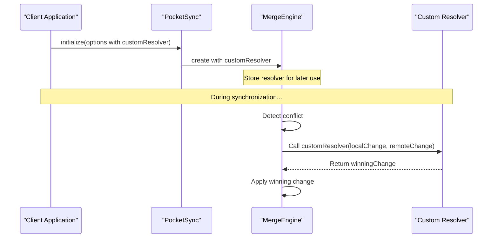

For applications with specific requirements, PocketSync allows implementing custom conflict resolution logic:

- Set the conflict strategy to ConflictResolutionStrategy.custom
- Provide a custom resolver function that implements the ConflictResolver type
- The resolver receives both conflicting changes and must return the winning change

To use a custom conflict resolver, you must:

- Set the conflictResolutionStrategy to ConflictResolutionStrategy.custom in PocketSyncOptions
- Provide your custom resolver function in the customResolver parameter

Example configuration:

```dart
final pocketSync = await PocketSync.initialize(
  options: PocketSyncOptions(
    conflictStrategy: ConflictResolutionStrategy.custom,
    conflictResolver: (localChange, remoteChange) async {
      // Custom logic to determine the winning change
      if (localChange.tableName == 'priorities') {
        return localChange; // Local changes always win for the 'priorities' table
      } else {
        return remoteChange; // Server changes win for other tables
      }
    },
  ),
  // ... other configuration options
);
```

## Custom Conflict Resolver

The custom conflict resolver function receives two parameters:

| Parameter | Description |
|-----------|-------------|
| `localChange` | The local change that conflicts with the remote change |
| `remoteChange` | The remote change that conflicts with the local change |

The resolver must return the winning change.

### Example

```dart
final pocketSync = await PocketSync.initialize(
  options: PocketSyncOptions(
    conflictStrategy: ConflictResolutionStrategy.custom,
    conflictResolver: (localChange, remoteChange) async {
      // Custom logic to determine the winning change
      if (localChange.tableName == 'priorities') {
        return localChange; // Local changes always win for the 'priorities' table
      } else {
        return remoteChange; // Server changes win for other tables
      }
    },
  ),
  // ... other configuration options
);
```

The change object has the following properties:

| Property | Type | Description |
|----------|------|-------------|
| `id` | `String` | Unique identifier for the change |
| `tableName` | `String` | Name of the table being modified |
| `recordId` | `String` | ID of the record being modified |
| `operation` | `ChangeType` | Type of operation (insert, update, delete) |
| `timestamp` | `int` | When the change occurred (milliseconds since epoch) |
| `version` | `int` | Version number of the change |
| `synced` | `bool` | Whether the change has been synced to the server |
| `data` | `Map<String, dynamic>` | The actual data changes for the record |

> Import note: The data property should always contain a "old" and "new" key. This is needed to maintain consistency with the default conflict resolution strategy.

### Conflict Resolution Process

