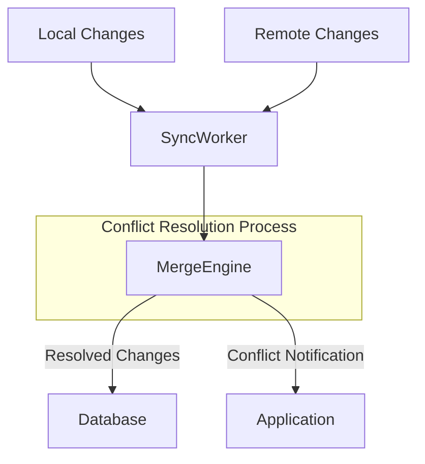
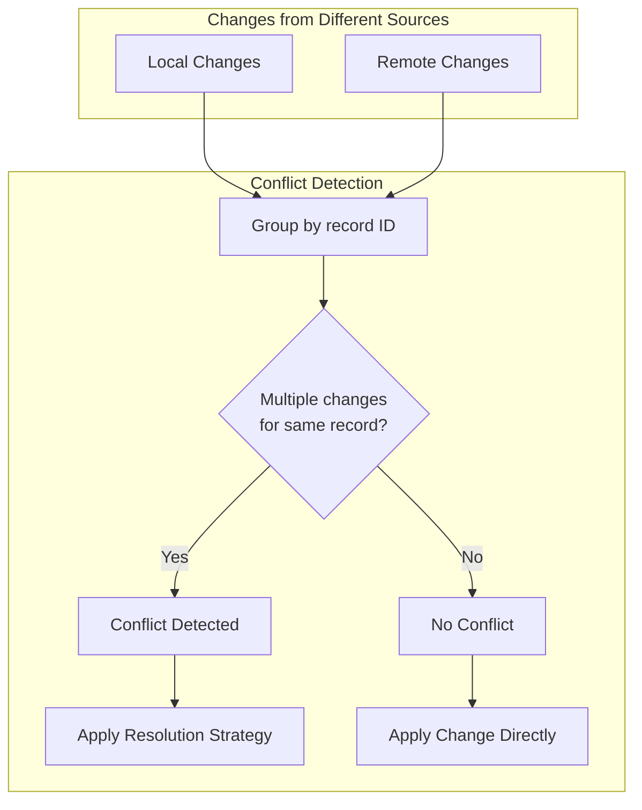

In distributed systems like PocketSync, conflicts occur when multiple devices modify the same database record without immediate synchronization. The MergeEngine component is responsible for detecting these conflicts and resolving them according to configurable strategies.

## Conflict detection
A conflict is detected when both the local device and the server have changes for the same record. The MergeEngine identifies conflicts by grouping changes by their unique record identifier (table name + record ID).

## Conflict resolution strategies
PocketSync supports four different strategies for resolving conflicts, defined in ConflictResolutionStrategy:

| Strategy | Description | Use Case |
|----------|-------------|----------|
| `lastWriteWins` (Default) | Most recent change based on timestamp wins | General purpose, when recent changes are typically more relevant |
| `serverWins` | Remote changes always take precedence | When the server is considered the source of truth |
| `clientWins` | Local changes always take precedence | When local user actions should override server changes |
| `custom` | Uses a developer-provided resolver function | Complex scenarios requiring application-specific logic |

## Best practices

When working with PocketSync's conflict resolution:

- Choose the appropriate strategy for your application's needs
- Use custom resolution for complex business logic requirements

## Limitations

The current conflict resolution system has these limitations:

- Conflicts are resolved at the record level, not at the field level
- The default last-write-wins strategy depends on accurate device timestamps
- Conflicts between delete and update operations always follow the configured strategy

For more advanced conflict resolution needs, see [custom conflict resolution](/advanced/custom-conflict-resolution).