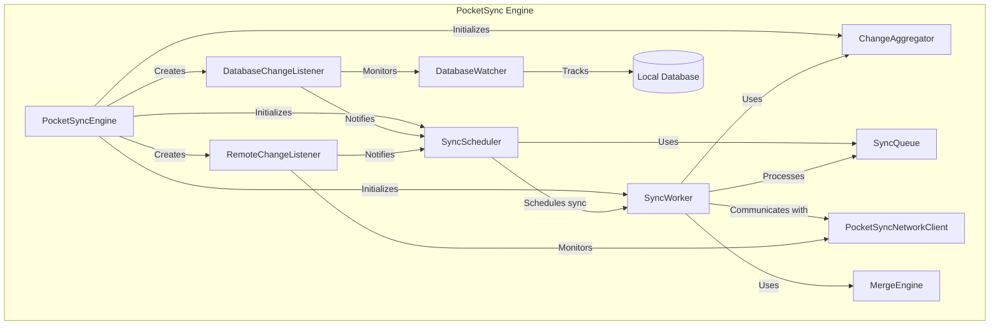
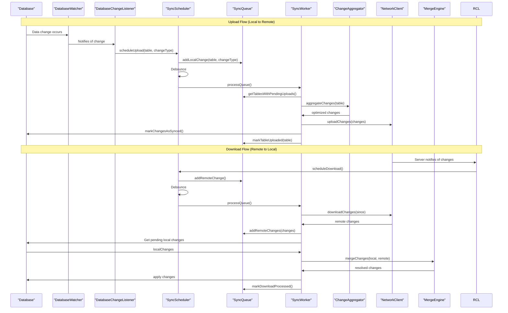

## PocketSync

The PocketSync class is the main entry point for using PocketSync. It provides methods for initializing PocketSync, setting the user ID, starting and stopping the sync process, and resetting change tracking.

> **Important**: Before using PocketSync, you must first call the `initialize` method to set up the system. The sync process won't begin automatically - you need to explicitly call the `start` method. Always make sure to set a user identifier with `setUserId` before initiating synchronization.

## PocketSync Engine

The PocketSync Engine is the core component of PocketSync. It is responsible for managing the synchronization process and coordinating the work of other components.

## Synchronization process

The synchronization process in PocketSync follows a well-defined flow for both uploads (local to remote) and downloads (remote to local):

### Upload process details

When local changes occur:

- `DatabaseWatcher` detects changes and notifies listeners.
- `DatabaseChangeListener` schedules an upload through `SyncScheduler`.
- `SyncScheduler` adds the change to `SyncQueue` and debounces multiple changes.
- After debouncing, `SyncWorker` processes the queue:
    - Retrieves tables with pending changes
    - Uses ChangeAggregator to optimize the changes
    - Sends changes to the server via PocketSyncNetworkClient
    - Marks processed changes as synced in the database
    - Updates the queue state

### Download process details

When remote changes are available:

- `RemoteChangeListener` is notified of changes via the network client.
- `SyncScheduler` schedules a download by adding a remote change to `SyncQueue`.
- After debouncing, `SyncWorker` processes the queue:
    - Downloads changes from the server
    - Retrieves related local changes that might conflict
    - Uses MergeEngine to resolve conflicts
    - Applies merged changes to the database
    - Updates the device state with the last download timestamp
    - Notifies listeners about the applied changes

## Optimizations

### Change aggregation

The `ChangeAggregator` optimizes changes before transmission to reduce network usage and improve performance:

- Multiple changes to the same record are consolidated into a single change.
- Insert followed by an update is converted to a single insert.
- Insert followed by a delete cancels both operations.
- Updates to unrelated fields are combined into a single update operation.

### Debouncing

The `SyncScheduler` uses debouncing to reduce the frequency of sync operations:

- When changes occur in rapid succession, the scheduler waits until changes stop for a configured interval.
- This prevents unnecessary server communication when a user is actively modifying data.
- Different debounce timers are maintained for uploads and downloads to optimize each process independently.

Note that no polling is used to detect changes. PocketSync uses a push-based approach to detect changes. 